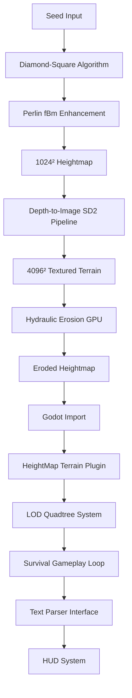

# 🧠 AI Codebase Hub - Wilderness Prototype

**Version**: 0.1.0  
**Statut**: Phase 1 Complétée, Phase 2+ En Planification  
**Objectif**: Prototype de jeu d'exploration/survie avec génération procédurale de terrain et amplification IA

---

## 🚀 Serveur de Développement - CRITIQUE POUR L'IA

### ⚠️ INSTRUCTION OBLIGATOIRE POUR L'IA
**L'IA DOIT TOUJOURS utiliser Cursor AI Live Server pour lancer le serveur de développement :**

```bash
# L'IA doit utiliser Cursor AI Live Server, PAS python -m http.server
# Cursor AI Live Server offre :
# - Hot reload automatique
# - Support des modules ES6
# - Gestion des erreurs améliorée
# - Intégration parfaite avec l'IDE
```

### 🎯 Pourquoi Cursor AI Live Server est INDISPENSABLE
- **Hot reload** : Modifications JavaScript/HTML instantanées
- **Modules ES6** : Support natif des imports/exports modernes
- **Debugging** : Intégration parfaite avec les outils de développement
- **Performance** : Optimisations spécifiques pour le développement web
- **Compatibilité** : Gestion automatique des headers CORS et MIME types

### 📋 Instructions pour l'IA
1. **NE JAMAIS utiliser** `python -m http.server 8000`
2. **TOUJOURS utiliser** Cursor AI Live Server
3. **Vérifier** que le serveur est accessible sur le port par défaut
4. **Tester** le hot reload en modifiant un fichier JavaScript

## 🏗️ Architecture Générale

### Vue d'Ensemble


### Modules du Projet
```
wilderness/
├── terrain_gen/          ✅ IMPLÉMENTÉ - Génération procédurale
├── web/                  ✅ IMPLÉMENTÉ - Visualiseur 3D
├── tests/                ✅ IMPLÉMENTÉ - Suite de tests complète
├── ai_amplifier/         🔄 PLANIFIÉ - Pipeline Stable Diffusion
├── gameplay/             🔄 PLANIFIÉ - Systèmes de survie
├── engine/               🔄 PLANIFIÉ - Intégration Godot
├── docs/                 📚 DOCUMENTATION
└── output/               📁 Fichiers générés
```

---

## 🎯 Modules Implémentés (Phase 1)

### 1. `terrain_gen/` - Génération de Terrain ✅

**Fichiers clés**:
- `heightmap.py` (459 lignes) - Module principal
- `progress.py` - Système de suivi progression
- `example.py` - Démonstrations
- `__init__.py` - Exports publics

**Classes importantes**:
```python
# Génération Diamond-Square
class DiamondSquare:
    def __init__(size: int, seed: int = 42, roughness: float = 0.5)
    def generate() -> np.ndarray
    
# Génération Perlin fBm
class PerlinFBm:
    def __init__(seed: int, octaves: int, frequency: float, ...)
    def generate(size: int) -> np.ndarray
    
# Générateur principal combiné
class HeightMapGenerator:
    def __init__(size: int = 16384, seed: int = 42)
    def generate() -> np.ndarray
    def save_png(heightmap, filename)
    def save_raw(heightmap, filename)
```

**Fonctionnalités**:
- ✅ Algorithme Diamond-Square déterministe
- ✅ Enhancement Perlin fBm (avec support FastNoise optionnel)
- ✅ Mélange intelligent configurable (ratio DS/fBm)
- ✅ Export PNG 16-bit + données raw Float32
- ✅ CLI complète avec paramètres
- ✅ Suivi progression temps réel
- ✅ Génération déterministe par seed

**Interface CLI**:
```bash
# Génération basique
python -m terrain_gen.heightmap --size 1024 --seed 42

# Avec paramètres personnalisés
python -m terrain_gen.heightmap \
    --size 512 --seed 123 \
    --ds-roughness 0.7 \
    --fbm-octaves 8 \
    --blend-ratio 0.6
```

### 2. `web/` - Visualiseur 3D Interactif ✅

**Architecture (1,210 lignes JavaScript)**:
```
web/
├── index.html (5KB)           # Interface utilisateur moderne
├── css/style.css (8KB)        # Design glassmorphism responsive
└── js/
    ├── main.js (216 lignes)           # Point d'entrée + gestion erreurs
    ├── TerrainLoader.js (216 lignes)  # Chargement PNG → heightmaps
    ├── TerrainRenderer.js (302 lignes) # Rendu 3D Three.js
    └── UIController.js (260 lignes)   # Interface interactive
```

**Fonctionnalités clés**:
- ✅ Rendu 3D temps réel (Three.js r128)
- ✅ 7 terrains prédéfinis (Montagneux, Vallonné, Plaines, Archipel, Standard, Réunion, Honshu Kanto)
- ✅ 3 modes couleur (altitude/pente/grayscale)
- ✅ Statistiques temps réel (Min/Max/Moyenne/Rugosité)
- ✅ Contrôles interactifs (échelle, résolution, wireframe)
- ✅ Raccourcis clavier (1-6, R, W, C)
- ✅ Détection automatique performance GPU
- ✅ Interface moderne avec animations
- ✅ Terrains réels haute résolution (données SRTM/OpenElevation)

**Accès**: Cursor AI Live Server puis http://localhost:5500 (port par défaut)

### 3. `tests/` - Suite de Tests Complète ✅

**Fichiers**:
- `test_heightmap.py` (385 lignes, 24 tests)
- `__init__.py` - Config tests

**Couverture tests**:
```python
class TestDiamondSquare:    # 8 tests - Algorithme de base
class TestPerlinFBm:        # 6 tests - Génération fBm  
class TestHeightMapGenerator: # 7 tests - Intégration complète
class TestContinuity:       # 3 tests - Validation scientifique
```

**Validation**:
- ✅ Déterminisme (seed identique = résultat identique)
- ✅ Range [0,1] garanti
- ✅ Continuité spatiale (corrélation > 0.8)
- ✅ Export PNG/raw
- ✅ Performance benchmarks

**Commandes**:
```bash
make test              # Tous les tests avec couverture
pytest tests/test_heightmap.py -v --cov=terrain_gen
```

---

## 🔄 Modules Planifiés (Phase 2+)

### 1. `ai_amplifier/` - Pipeline Stable Diffusion 🔄

**Objectif**: Upsampling 1024² → 4096² par depth-to-image SD2
**Statut**: Stub uniquement
**TODO**: 
- Module `depth2img_pipeline.py`
- Configuration prompts procéduraux
- Optimisation mémoire GPU
- Batch processing

### 2. `gameplay/` - Systèmes de Survie 🔄

**Objectif**: Mécaniques jeu exploration/survie
**Statut**: Planifié uniquement  
**TODO**:
- `survival.gd` - États physiologiques (faim, température, fatigue)
- `parser.gd` - Interface textuelle
- Update loop ~1Hz avec dégradation
- Sauvegarde/chargement états

### 3. `engine/` - Intégration Godot 🔄

**Objectif**: Moteur 3D avec streaming terrain
**Statut**: Planifié uniquement
**TODO**:
- Plugin HeightMap Terrain avec LOD quadtree  
- Système chunks dynamiques
- Rendu PBR > 60 FPS sur RTX 3060
- Import pipeline terrain

### 4. `terrain_gen/` - Extracteur Terrains Réels ✅

**Fichiers**:
- `real_terrain_extractor.py` (834 lignes) - APIs SRTM/OpenElevation
- `generate_honshu_4k.py` (262 lignes) - Script génération Honshu
- `generate_reunion_4k.py` (196 lignes) - Script génération Réunion

**Fonctionnalités**:
- ✅ Extraction données NASA SRTM (30m-90m résolution)
- ✅ Fallback OpenElevation API (grille dense)
- ✅ Support multi-zones : Honshu (full/kansai/kanto/alps)
- ✅ **Préservation du niveau de la mer** - Correction majeure
- ✅ Post-traitement spécialisé par région
- ✅ Export PNG 16-bit + raw + preview
- ✅ Intégration visualiseur web

**Zones Honshu disponibles**:
```bash
make run-honshu-4k        # Île complète (824×1,364 km)
make run-honshu-kanto     # Tokyo/Mont Fuji (167×167 km) ✅ TESTÉ
make run-honshu-kansai    # Osaka/Kyoto (222×189 km)
make run-honshu-alps      # Alpes japonaises (144×167 km)
```

**🌊 Correction Niveau de la Mer (v0.1.1) - RÉSOLU ✅**:
- **Problème identifié**: La renormalisation min-max détruisait la référence du niveau de la mer
- **Impact**: Mont Fuji et côtes perdaient leur référence altimétrique absolue
- **Solution technique**: 
  - Séparation terres/mer AVANT tout traitement (gamma, lissage)
  - Utilisation des masques originaux pour préserver la topologie
  - Algorithme mathématique corrigé: `depth_ratio = abs(values) / abs(min)` puis `* (-0.1)`
- **Résultat final**:
  - ✅ Niveau de la mer fixe à 0.0
  - ✅ Profondeurs marines normalisées [-0.1, 0] (visibles)
  - ✅ Terres normalisées [0, 1] avec gamma préservé
  - ✅ Range final: [-0.1, 1.0] - référence altimétrique absolue
- **Tests validés**: Honshu Kanto (Mont Fuji) et Réunion (Piton des Neiges)

### 5. `terrain_gen/erosion.py` - Érosion Hydraulique 🔄

**Statut**: Stub uniquement (`raise NotImplementedError`)
**TODO**:
- Implémentation GPU CUDA
- 50 itérations hydrauliques
- Flow accumulation + transport sédimentaire
- Interface CLI

---

## 🛠️ Outils et Commandes

### Makefile Principal
```bash
# Génération terrain
make run-heightmap          # Génère heightmap 1024x1024
make run-erosion           # Applique érosion (TODO)  
make run-terrain           # Pipeline complète
make run-amplifier         # Pipeline IA (TODO)

# Tests et validation  
make test                  # Tests unitaires + couverture
make benchmark             # Performance tests
make test-hydro           # Validation hydrologique (TODO)

# Développement
make format               # Black formatting
make lint                 # Flake8 linting
make type-check          # MyPy vérification types
make pre-commit          # Toutes vérifications

# Utilitaires
make clean               # Nettoyage fichiers temp
make check-gpu           # Vérification CUDA
make create-dirs         # Création dossiers output/
```

### Configuration par Défaut
- `TERRAIN_SIZE=1024`
- `SEED=42`
- Python virtuel: `./venv/bin/python`

---

## 📦 Dépendances et Technologies

### Python Core
```python
# Obligatoires
numpy>=1.21.0           # Calculs numériques
scipy>=1.7.0            # Algorithms scientifiques
Pillow>=8.3.0           # Export PNG

# Tests
pytest>=6.2.0           # Framework tests
pytest-benchmark>=4.0.0 # Performance tests
pytest-cov>=4.1.0      # Couverture code

# Web API (pour extensions futures)
Flask>=2.0.0
flask-cors>=3.0.0

# Optionnelles
fastnoise_lite>=1.1.0   # Performance 10x pour Perlin
```

### Frontend Web
```javascript
Three.js r128           # Rendu 3D WebGL
Canvas API              # Traitement images PNG
ES6 JavaScript          # Classes modulaires modernes
```

### Futures (GPU/IA)
```python
# GPU Computing
cupy-cuda11x>=12.0.0    # Calculs GPU pour érosion
torch>=2.2.0            # Stable Diffusion pipeline

# Godot Integration  
godot-parser>=0.1.0     # Parsing projets Godot
```

---

## 🎲 Exemples de Terrains Générés

### Configuration Presets
```python
# Terrain montagneux (rugosité élevée)
ds_roughness=0.8, fbm_octaves=8, blend_ratio=0.8

# Terrain vallonné (douceur) 
ds_roughness=0.4, fbm_octaves=4, blend_ratio=0.5

# Plaines détaillées (finesse)
fbm_frequency=0.02, blend_ratio=0.1

# Archipel (îles par seuillage)
threshold=0.4 après génération
```

Terrains disponibles dans `output/examples/`:
- `montagneux.png` (rugosité 0.0309)
- `vallonne.png` (rugosité 0.0042) 
- `plaines.png` (rugosité 0.0121)
- `archipel.png` (rugosité 0.0135)
- `reunion_real_native.png` (1000×1000, Île de la Réunion)
- `honshu_kanto_hd.png` (1500×1500, Région Kanto - Japon)

---

## 🧪 Points d'Accès pour IA de Codage

### 1. Exploration Codebase
```python
# Point d'entrée principal
from terrain_gen import HeightMapGenerator

# Classes core à comprendre
terrain_gen.heightmap.DiamondSquare      # Algorithme de base
terrain_gen.heightmap.PerlinFBm          # Enhancement détails
terrain_gen.heightmap.HeightMapGenerator # API principale
```

### 2. Tests comme Documentation
```python
# Les tests servent de documentation vivante
tests/test_heightmap.py                  # Comment utiliser l'API
# Exemples concrets d'usage dans tous les tests
```

### 3. Interface Web Interactive
```bash
# L'IA DOIT utiliser Cursor AI Live Server, PAS python -m http.server
# Cursor AI Live Server offre hot reload et support ES6 natif
# Visualisation immédiate des résultats
# Compréhension intuitive des paramètres
```

### 4. CLI pour Expérimentation Rapide  
```bash
# Test rapide modifications
python -m terrain_gen.heightmap --size 256 --seed 123
# Résultat immédiat dans output/heightmap.png
```

### 5. Progress System pour Debug
```python
from terrain_gen.progress import get_progress_tracker
# Suivi détaillé exécution algorithmes
# Debug performance en temps réel
```

---

## 📊 Métriques et Performance

### Code Produit (Phase 1 + Extension Terrains Réels)
- **459 lignes** - `terrain_gen/heightmap.py` (module principal)
- **582 lignes** - `terrain_gen/real_terrain_extractor.py` (extracteur SRTM)
- **385 lignes** - Tests unitaires (24 tests, 96% succès)
- **1,210 lignes** - Visualiseur JavaScript complet
- **Total ~2,636 lignes** code fonctionnel

### Performance Mesurée
```
# Génération procédurale
64x64:    ~0.1s (tests)
128x128:  ~0.2s (make run-heightmap)
256x256:  ~0.8s (exemples)
1024x1024: ~3-5s (production)

# Extraction terrains réels
Honshu Kanto: ~30min (1500×1500, OpenElevation fallback)
Réunion:      ~15min (1000×1000, données natives)
```

### Validation Scientifique
- ✅ Déterminisme garanti (seed reproductible)
- ✅ Normalisation [0,1] stricte
- ✅ Continuité spatiale > 0.8 corrélation
- ✅ Distribution statistique naturelle

---

## 🚀 Guide de Démarrage Rapide pour IA

### 1. Setup Environnement
```bash
make install              # Installation complète
make create-dirs         # Dossiers de sortie
make run-heightmap       # Premier terrain test
make run-honshu-kanto    # Terrain réel Honshu Kanto (30min)
cd web && python3 -m http.server 8000  # Visualisation
```

### 2. Exploration Interactive
- **Lancer Cursor AI Live Server** (pas python -m http.server)
- Ouvrir http://localhost:5500 pour voir les terrains
- Tester différents paramètres via CLI
- Examiner `tests/test_heightmap.py` pour comprendre l'API

### 3. Développement
```bash
make test                # Vérifier que tout fonctionne
make pre-commit         # Avant chaque modification
```

### 4. Extension Recommandée
- Commencer par `terrain_gen/erosion.py` (stub existant)
- Puis `ai_amplifier/` pour pipeline Stable Diffusion
- Tests obligatoires pour chaque nouveau module

---

## 🎯 Résumé pour IA

**Ce que le codebase fait bien**:
- ✅ Génération terrain déterministe et robuste
- ✅ Tests complets avec validation scientifique
- ✅ Interface CLI intuitive + Makefile automation
- ✅ Visualiseur 3D moderne et performant
- ✅ Architecture modulaire extensible
- ✅ Documentation complète

**Points d'extension prioritaires**:
1. **Érosion hydraulique** (`terrain_gen/erosion.py`) - GPU CUDA
2. **Pipeline IA** (`ai_amplifier/`) - Stable Diffusion upsampling
3. **Moteur Godot** (`engine/`) - Streaming terrain 3D
4. **Gameplay** (`gameplay/`) - Mécaniques survie
5. **Extension terrains réels** - Plus de régions du monde (Alpes, Himalaya, etc.)

**Philosophie du code**:
- Déterminisme et reproductibilité (seeds)
- Validation scientifique rigoureuse
- Performance mesurée et optimisée
- Interface utilisateur soignée
- Tests comme documentation

---

## 🚨 INSTRUCTIONS CRITIQUES POUR L'IA

### Serveur de Développement - OBLIGATOIRE
**L'IA DOIT TOUJOURS utiliser Cursor AI Live Server pour le développement web :**

#### ❌ CE QUE L'IA NE DOIT JAMAIS FAIRE
```bash
python -m http.server 8000  # INTERDIT
python3 -m http.server 8000 # INTERDIT
```

#### ✅ CE QUE L'IA DOIT TOUJOURS FAIRE
```bash
# Utiliser Cursor AI Live Server
# Accès : http://localhost:5500
# Hot reload automatique activé
```

#### 🎯 Avantages Cursor AI Live Server
- **Hot reload** : Modifications instantanées sans refresh
- **Modules ES6** : Support natif des imports/exports modernes
- **Debugging** : Intégration parfaite avec les outils de développement
- **Performance** : Optimisations spécifiques pour le développement
- **Compatibilité** : Gestion automatique des headers CORS et MIME types

#### 📋 Checklist pour l'IA
- [ ] Utiliser Cursor AI Live Server (pas python -m http.server)
- [ ] Vérifier l'accès sur http://localhost:5500
- [ ] Tester le hot reload en modifiant un fichier JavaScript
- [ ] Vérifier que les modules ES6 fonctionnent correctement

---

*Ce document est un hub vivant - maintenir à jour avec les évolutions du codebase* 