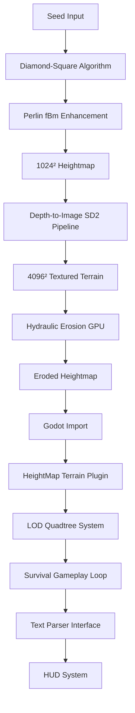

# Wilderness-like Prototype

Prototype de jeu d'exploration/survie avec génération procédurale de terrain et amplification IA.

## Architecture



## Structure du Projet

```
wilderness/
├── terrain_gen/          # Génération procédurale de terrain
│   ├── heightmap.py      # Diamond-Square + Perlin fBm
│   ├── erosion.py        # Érosion hydraulique GPU
│   └── README.md
├── ai_amplifier/         # Pipeline IA pour textures
│   ├── depth2img_pipeline.py
│   └── README.md
├── engine/               # Projet Godot
│   ├── project.godot
│   ├── terrain/          # Scripts terrain et LOD
│   └── README.md
├── gameplay/             # Système de survie
│   ├── survival.gd       # États physiologiques
│   ├── parser.gd         # Parser textuel
│   └── README.md
├── tests/                # Tests et benchmarks
│   ├── test_heightmap.py
│   ├── test_hydro.py
│   ├── benchmark_fps.py
│   └── README.md
└── docs/                 # Documentation
```

## Installation

### Prérequis
- Python 3.10+
- CUDA 11.8+ (pour érosion GPU)
- Godot 4.2+
- Make

### Dépendances Python
```bash
pip install -r requirements.txt
```

### Configuration Godot
```bash
# Installer le plugin HeightMap Terrain
cd engine/
# Instructions détaillées dans engine/README.md
```

## Utilisation

### Génération de Terrain
```bash
# Générer une heightmap 1024²
make run-heightmap

# Appliquer l'érosion hydraulique
make run-erosion

# Pipeline complète
make run-terrain
```

### Amplification IA
```bash
# Upsampling depth-to-image
make run-amplifier
```

### Tests
```bash
# Tests unitaires
make test

# Benchmarks performance
make benchmark

# Validation hydrologique
make test-hydro
```

## Targets Make

- `make run-heightmap` : Génération heightmap Diamond-Square + Perlin
- `make run-erosion` : Érosion hydraulique GPU
- `make run-amplifier` : Pipeline Stable Diffusion
- `make test` : Tous les tests unitaires
- `make benchmark` : Tests de performance (> 60 FPS sur RTX 3060)
- `make test-hydro` : Validation flow accumulation
- `make clean` : Nettoyage des fichiers temporaires

## Spécifications Techniques

### Génération de Terrain
- **Résolution initiale** : 1024² heightmap
- **Algorithmes** : Diamond-Square + Perlin fBm
- **Paramètres** : seed, octaves, gain, lacunarity
- **Format de sortie** : PNG 16-bit + données raw

### Amplification IA
- **Modèle** : Stable Diffusion 2 depth-to-image
- **Résolution finale** : 4096² textures
- **Pipeline** : diffusers >= 0.27
- **Contrôle** : depth map + prompts procéduraux

### Érosion Hydraulique
- **Implémentation** : GPU CUDA
- **Itérations** : 50 passes
- **Physique** : Flow accumulation, transport sédimentaire
- **Performance** : > 60 FPS sur RTX 3060

### Moteur Godot
- **Version** : Godot 4.2+
- **Plugin** : HeightMap Terrain avec LOD quadtree
- **Streaming** : Chargement dynamique par chunks
- **Rendu** : PBR avec normal maps générées

## Licence

MIT License - voir LICENSE pour les détails.

Tous les assets générés sont sous licence CC-BY. 